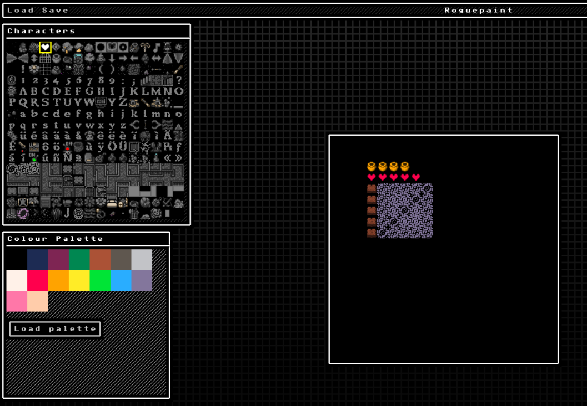
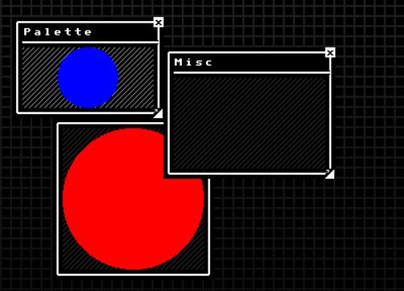
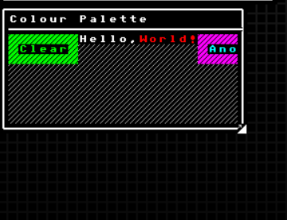

[](https://github.com/tterb/atomic-design-ui/blob/master/LICENSEs)
[](https://github.com/PurpleKingdomGames/roguelike-starterkit/releases)
[](https://discord.gg/b5CD47g)
[](https://github.com/PurpleKingdomGames/roguelike-starterkit/actions/workflows/ci.yml)

# Roguelike Starter-Kit for Indigo

A library for use with [Indigo](https://indigoengine.io/) to provide some terminal-like rendering functionality specifically for ASCII art style games, and roguelike games in particular.

An early version of this code was used to build the [follow along examples](https://github.com/davesmith00000/roguelike-tutorial) to the [Roguelike tutorials](http://rogueliketutorials.com/). I'm still using this library in my revised [Roguelike demo game](https://github.com/davesmith00000/roguelike).

> Please note that follow along tutorials will be upgraded to use this library at some point.


## Installation

Add the following dependency to your Indigo based game project (alongside the usual indigo ones):

> Check the badge at the top of this readme, or releases for the latest version number

### sbt

`"io.indigoengine" %%% "roguelike-starterkit" % "x.y.z"`

### Mill

`ivy"io.indigoengine::roguelike-starterkit::0.4.0"`

## Usage

Everything can be accessed via this import:

```scala
import io.indigoengine.roguelike.starterkit.*
```

## Running the demo

Download the repo, `cd` into the repo directory, run `yarn install` or `npm install`, the run `sbt runGame`.

You can hit the space bar to switch between the rendering modes.

Please note that the `TerminalText` scene has two examples on it, first the standard component and then a second component that uses a custom shader.

## What this library is

If you want to build a roguelike game, then you need to be able to render something that looks like a terminal with ASCII art.

In Python, people use a library called [tcod](https://python-tcod.readthedocs.io/en/latest/). The roguelike-starterkit is not a full implementation of tcod, but it provides some of the key functionality you will need in a purely functional form.

The starter-kit also includes UI / Window management tools.

## What roguelikes are

[Roguelike](https://en.wikipedia.org/wiki/Roguelike)'s are a type of game that get their name because they are ...wait for it ..._like_ an 80s game called _Rogue_!

They typically use ASCII art for graphics, generated levels / dungeons and feature things like perma-death.

## Indigo vs Roguelike's

A few people have asked about using Indigo for Roguelike game building over the years, and it has come up again in response to the annual [r/roguelikedev - RoguelikeDev Does The Complete Roguelike Tutorial](https://www.reddit.com/r/roguelikedev/comments/o5x585/roguelikedev_does_the_complete_roguelike_tutorial/).

There are some specific challenges with regards to Indigo rendering the seemingly straightforward graphics of a roguelike that I won't go into here, but I've generally had to caution people that Indigo _might not be good at this..._

This library is an attempt to open up roguelikes to Indigo game builders by going some way towards solving some of the rendering issues and providing out-of-the-box support for a standard roguelike artwork format, namely the Dwarf Fortress tile sets.

## Finding artwork

One of the great things about roguelikes is that they're usually ASCII art, and there is a wealth of available art "packs" that were created for the well known roguelike, [Dwarf Fortress](https://en.wikipedia.org/wiki/Dwarf_Fortress).

**This is excellent news for programmers!**

You can go ahead and build a game and it will look ...exactly like all the other ones! The quality of your game will be judged on the strength of your ability to code up a world, not on your ability to draw trees and people. Perfect!

This starter pack takes a Dwarf Fortress image that looks like this:


([There are lots more of them to choose from!](https://dwarffortresswiki.org/Tileset_repository))

The project then uses custom shaders that allow you to set the foreground and background colours to render your world based on any of the standard format tile sheets you can find / make.

> It appears the the only graphical requirements are that you can set the foreground and background colors. If this isn't true please raise any issue!

## ASCII Art Materials

Rendering ASCII art means setting three things:

1. The character
1. The foreground color (implemented as a tint to retain shading)
1. The background color (which overrides a "mask" color with another color value - the mask color is magenta by default)

### `TerminalText`

This is a material for use with Indigo's standard `Text` primitive. In addition to foreground and background `TerminalText` also supports a solid colour dropshadow.

Looks great but has a glaring problem: Changing colors mid-artwork (e.g. setting the text red and the border blue) is a pain, you need to use another `Text` instance and make them line up!

Great for pop-up menus, and monochrome sections of ASCII art, or maps that aren't too big. After that, a new strategy may be needed.

[Example](https://github.com/PurpleKingdomGames/roguelike-starterkit/blob/main/demo/src/main/scala/demo/TerminalTextScene.scala)

### `TerminalMaterial`

This material is a near drop-in replacement for `TerminalText`. It does not support the drop shadow feature, but has a leaner implementation for performance sensitive contexts. Supposed to be used with the `TerminalEmulator`/`RogueTerminalEmulator`'s `toCloneTiles` method.

Additionally, `TerminalMaterial` will attempt to preserve tile colours. If you apply a foreground colour to a tile, it will only apply the tint to greyscale pixel values. This means you can have a tree with a brown trunk, but tint just the leaf colours to autumn reds, yellows, and greens.

## The `TerminalEmulator` and the `RogueTerminalEmulator`

The terminal emulators are the basis of the library, and provide a simple 'terminal-like' object you and interact with to represent grids of ASCII tiles. They come in two flavours, both of which have the same interface but behave differently:

1. The `TerminalEmulator` is the recommended default. It is safe and immutable and easy to use, perfect for getting started. The drawback of the `TerminalEmulator` is that is not very performant, and at some point you may find it necessary to start caching results.
2. The `RogueTerminalEmulator` is a more dangerous version of the `TerminalEmulator`! It is a mutable structure, and as such, much more performant. As with all mutable data types, it must be handled with more care. Generally speaking though, you should be able to use it as a drop in replacement for the `TerminalEmulator`.

### Rendering with `CloneTiles`

To render the contents of a `TerminalEmulator` or a `RogueTerminalEmulator` we need to output `CloneTiles`.

Performance will vary by scene complexity, specifically how many unique colour combinations you have in place. In other words, if all your tiles are identical, the scene will be boring but rendering quickly. If every tile is unique then rendering will be slow(er).

[Example](https://github.com/PurpleKingdomGames/roguelike-starterkit/blob/main/demo/src/main/scala/demo/TerminalEmulatorScene.scala)

## More tools!

Indigo itself also provides other handy tools, such as:

1. An implementation of Bresenham's Line algorithm, used in the tutorial for line of sight across a grid.
2. A path finding implementation.

## Roguelike UI

The Roguelike Starterkit from 0.3.3 onwards includes a prototype UI system specifically for roguelikes. There is an example in the `UISubSystemScene` in the demo project in this repo.



### Getting started

#### Elm arch all the way down

The Rogue UI is implemented as a nested Elm arch (Indigo flavoured, of course). So the components are Elm arch via a typeclass, windows are Elm arch, as is the window manager. Windows in fact run mini-indigo games for their content.

#### Language and Scale

The Rogue UI was aimed at terminal rendering, and so the UI is based on an ASCII like grid (no need to render in ASCII, however). So we have types to describe that which are different from Indigo's normal types - though they are very similar - in the hope of reducing confusion. For example, we could describe the size of a window with a standard `Size` type - but what is size measured in? `Size` normally means some notion of 'pixels', but on the UI grid, we want to mean 'grid squares / coordinates' and so we use `Dimensions` instead.

- `Bounds` - like `Rectangle`, but for a grid
- `Coords` - like `Point`, but for a grid
- `Dimensions` - like `Size`, but for a grid

#### Organisation

The UI is organised in two parts:

##### 1 - Windows



Windows work as you'd expect, albeit on a fixed grid, giving you the ability to move, resize, open and close them.

Windows are controlled by the `WindowManager`, which is a `SubSystem` responsible for controlling their life cycle, layout, and event propogation.

Window's do not have to render components (see below), as they are basically mini Indigo games, and can render anything Indigo can. When rendering content into a window though, you are responsible for adhering to it's content window bounds information, which can be found within the provided `UiContext`, which is much the same as a `FrameContext`, with some extra window specific data attached to it.

For window's to understand your content, you will need to provide an instance of the `WindowContent[A]` typeclass. One already exists for `ComponentGroups` below.

Windows and their contents can be controlled via `WindowEvent`s.

##### 2 - Components



Components (buttons, labels, `ComponentGroups`, etc., anything with a `Component` typeclass) are ui elements that work on the Rogue UI's grid system.

Strictly speaking you don't need to use them with the window system, but they are handy.

`Component`s can optionally be organised into `ComponentGroup`s (which are themselves components). Component groups know how to organise components, based on a `ComponentLayout` instance, for instance you can tell the components to lay themselves out in a row and wrap or overflow. 

#### UI Shaders

The Rogue UI has some custom shaders (for things like window content masking), on top of the other RLSK shaders. The easiest way to include them all is as follows:

```scala
def boot(flags: Map[String, String]): Outcome[BootResult[Size]] =
  Outcome(
    BootResult(...)
      .withShaders(
        roguelikestarterkit.shaders.all
      )
  )
```

#### Rendering / Graphics

Being part of the RLSK, under the covers, the Rogue UI is rendered using terminal emulators and character sheets.

To change the graphics of your UI, all you have to do is replace the appropriate characters on a sprite sheet as if it were like a 9-slice (kinda), and feed it to the game / UI system.
